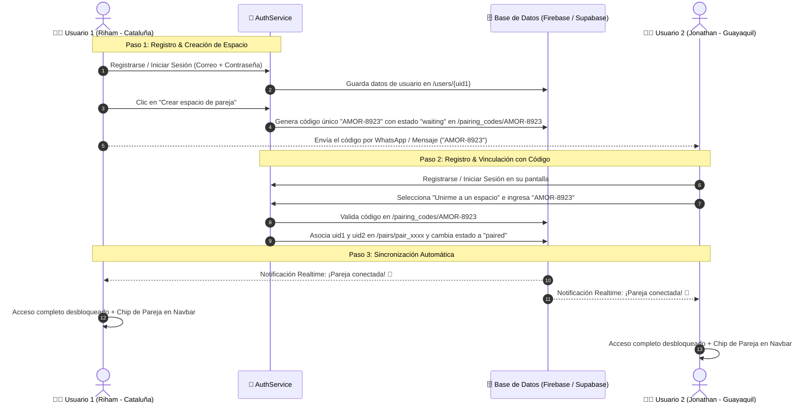

# 💖 Guía del Sistema de Autenticación y Vinculación Privada de Pareja

Este documento detalla la arquitectura, el flujo de vinculación y la estructura de datos (Firebase / Supabase) para el **Sistema de Autenticación y Vinculación Privada de Pareja** de Jonathan & Riham.

---

## 🚀 1. Flujo de Funcionamiento del Módulo



---

## 🗄️ 2. Estructura de Datos (Data Schema)

### A. Estructura en Firebase Realtime Database (JSON)

```json
{
  "users": {
    "usr_riham_123": {
      "uid": "usr_riham_123",
      "email": "riham@nuestro-universo.com",
      "displayName": "Riham",
      "role": "riham",
      "location": "Cataluña, España 🇪🇸",
      "avatar": "👧🏻🌸",
      "pairId": "pair_amor_2026",
      "createdAt": "2026-05-21T00:00:00.000Z",
      "lastLogin": "2026-09-17T20:00:00.000Z"
    },
    "usr_jonathan_456": {
      "uid": "usr_jonathan_456",
      "email": "jonathan@nuestro-universo.com",
      "displayName": "Jonathan",
      "role": "jonathan",
      "location": "Guayaquil, Ecuador 🇪🇨",
      "avatar": "👦🏻✨",
      "pairId": "pair_amor_2026",
      "createdAt": "2026-05-21T00:00:00.000Z",
      "lastLogin": "2026-09-17T20:00:00.000Z"
    }
  },

  "pairing_codes": {
    "AMOR-8923": {
      "code": "AMOR-8923",
      "pairId": "pair_amor_2026",
      "createdBy": "usr_riham_123",
      "createdAt": "2026-09-17T20:00:00.000Z",
      "status": "paired" // "waiting" | "paired"
    }
  },

  "pairs": {
    "pair_amor_2026": {
      "pairId": "pair_amor_2026",
      "code": "AMOR-8923",
      "status": "paired",
      "createdAt": "2026-09-17T20:00:00.000Z",
      "pairedAt": "2026-09-17T20:02:00.000Z",
      "members": {
        "usr_riham_123": {
          "uid": "usr_riham_123",
          "name": "Riham",
          "role": "riham",
          "location": "Cataluña, España 🇪🇸"
        },
        "usr_jonathan_456": {
          "uid": "usr_jonathan_456",
          "name": "Jonathan",
          "role": "jonathan",
          "location": "Guayaquil, Ecuador 🇪🇨"
        }
      },
      "events": {
        "hugs": {
          "hug_001": {
            "id": "hug_001",
            "sender": "riham",
            "type": "apretado",
            "message": "Te extraño mi amor lindo",
            "timestamp": 1789668000000
          }
        },
        "notes": {
          "note_001": {
            "id": "note_001",
            "author": "Riham",
            "text": "Hoy jugamos a las 20:00 🎮",
            "color": "pink",
            "timestamp": 1789668100000
          }
        },
        "forget_items": {
          "fgt_001": {
            "id": "fgt_001",
            "title": "Tomar agua mientras juegas Roblox",
            "emoji": "💧",
            "consequence": "1 beso de penalización",
            "completed": false
          }
        }
      }
    }
  }
}
```

---

### B. Esquema SQL para Supabase (PostgreSQL + Realtime)

Si prefieres usar Supabase, ejecuta este script en el **SQL Editor** de tu proyecto de Supabase:

```sql
-- 1. Tabla de Espacios de Pareja
CREATE TABLE IF NOT EXISTS public.pair_spaces (
    id UUID PRIMARY KEY DEFAULT gen_random_uuid(),
    code VARCHAR(20) UNIQUE NOT NULL,
    status VARCHAR(20) DEFAULT 'waiting', -- 'waiting' | 'paired'
    user1_id UUID REFERENCES auth.users(id) ON DELETE CASCADE,
    user2_id UUID REFERENCES auth.users(id) ON DELETE SET NULL,
    created_at TIMESTAMP WITH TIME ZONE DEFAULT NOW(),
    paired_at TIMESTAMP WITH TIME ZONE
);

-- 2. Tabla de Eventos de Pareja (Abrazos, Notas, Olvidos)
CREATE TABLE IF NOT EXISTS public.pair_events (
    id UUID PRIMARY KEY DEFAULT gen_random_uuid(),
    pair_id UUID REFERENCES public.pair_spaces(id) ON DELETE CASCADE,
    sender_id UUID REFERENCES auth.users(id) ON DELETE CASCADE,
    event_type VARCHAR(50) NOT NULL, -- 'hug', 'note', 'forget_item'
    payload JSONB NOT NULL,
    created_at TIMESTAMP WITH TIME ZONE DEFAULT NOW()
);

-- 3. Habilitar Realtime
ALTER PUBLICATION supabase_realtime ADD TABLE public.pair_spaces;
ALTER PUBLICATION supabase_realtime ADD TABLE public.pair_events;

-- 4. Políticas de Seguridad RLS
ALTER TABLE public.pair_spaces ENABLE ROW LEVEL SECURITY;
ALTER TABLE public.pair_events ENABLE ROW LEVEL SECURITY;

CREATE POLICY "Los miembros pueden ver su espacio" ON public.pair_spaces
    FOR ALL USING (auth.uid() = user1_id OR auth.uid() = user2_id OR status = 'waiting');

CREATE POLICY "Los miembros pueden ver eventos de su espacio" ON public.pair_events
    FOR ALL USING (
        pair_id IN (
            SELECT id FROM public.pair_spaces 
            WHERE user1_id = auth.uid() OR user2_id = auth.uid()
        )
    );
```

---

## ⚙️ 3. Cómo Activar tu Backend en `auth-config.js`

Abre el archivo [auth-config.js](file:///c:/Users/Rehan/Desktop/PROYECTOS/Jonathan/auth-config.js) y edita las siguientes líneas:

### Para Firebase:
```javascript
const AUTH_PAIRING_CONFIG = {
  provider: "firebase", // Cambia a "firebase"

  firebase: {
    apiKey: "AIzaSyD-TuApiKeyRealDeFirebase...",
    authDomain: "tu-proyecto.firebaseapp.com",
    databaseURL: "https://tu-proyecto-default-rtdb.firebaseio.com",
    projectId: "tu-proyecto",
    storageBucket: "tu-proyecto.appspot.com",
    messagingSenderId: "1234567890",
    appId: "1:1234567890:web:abcdef"
  }
};
```

### Para Supabase:
```javascript
const AUTH_PAIRING_CONFIG = {
  provider: "supabase", // Cambia a "supabase"

  supabase: {
    url: "https://xyzcompany.supabase.co",
    anonKey: "eyJhbGciOiJIUzI1NiIsInR5cCI6IkpXVCJ9..."
  }
};
```

---

## 🧩 4. Integración con las Secciones del Sitio Web

El módulo expone el objeto global `window.AuthPairingService`:

```javascript
// 1. Enviar un abrazo sincronizado a la sala de pareja:
window.AuthPairingService.syncPairData("hug", {
  type: "apretado",
  message: "¡Te amo mi vida!",
  emoji: "🫂"
});

// 2. Escuchar eventos en tiempo real:
window.AuthPairingService.onPairData("hug", (event) => {
  console.log("¡Nuevo abrazo recibido!", event.payload);
});
```
